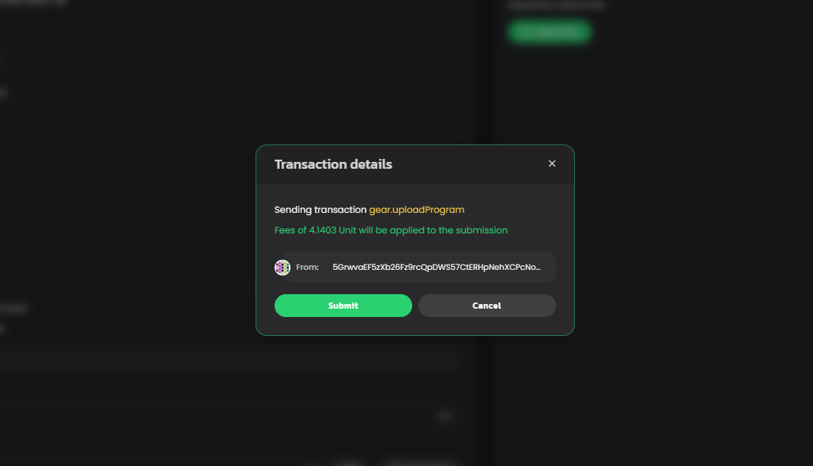
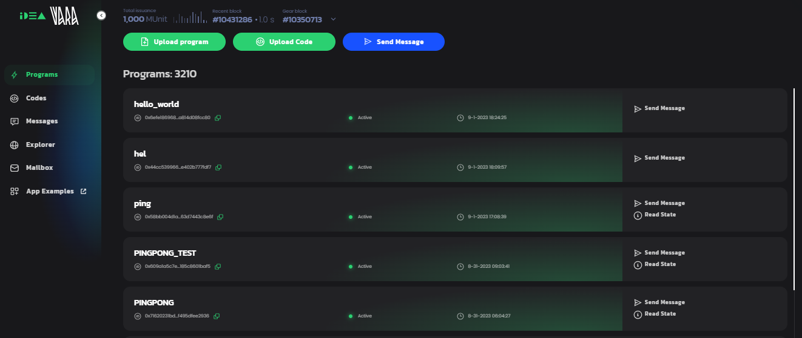

# 部署你的第一个 Gear 合约

## 0. `cargo build` 编译合约

下载 `./target/wasm32-unknown-unknown/debug/hello_world.opt.wasm`

## 1. 在 [Gear IDEA](https://idea.gear-tech.io/) 左下角菜单，切换到 `wss://testnet.vara.rs` RPC 节点

## 2. 点击 Upload Program, 选择合约二进制文件 `hello_world.opt.wasm` 并上传

## 3. 输入合约名称，点击 Calculate 预估交易费用

## 4. 签名交易，部署合约

## 5. 回到 Programs 列表，找到刚刚部署的合约

## 6. 点击合约标题，进入交互页面

## 7. 发送一条空白消息

## 8. 查看合约回复的消息

消息 Payload 中的 `0x1448656c6c6f` 就是 "Hello" 的 SCALE 编码 

